# 🏛️ The Empire Blueprint: Sovereign System Architecture

## 1. 👁️ The Visual Command Map

### "Who does What, When, Where, How, and Why."

```mermaid
graph TD
    %% Core Nodes
    BRAIN[(Supabase Brain<br>Memory & Logs)]
    GOV[👮 Governor<br>Self-Healing & Compliance]
    
    %% Marketing Leg (Spear)
    subgraph MARKETING ["🏹 SPEAR (Outbound Hunter)"]
        S1[Lead Scraper] -->|Raw Data| S2[ROI Calculator]
        S2 -->|Enriched Data| S3[Email Drafter]
        S3 -->|Draft| REV[User Review<br>Launch Check]
        REV -->|Approved| GHL_OUT[GHL Dispatcher]
    end
    
    %% Sales Leg (Spartan)
    subgraph SALES ["⚔️ SPARTAN (Inbound Closer)"]
        WEB[Landing Page<br>Widget] -->|Inbound Chat| WH[Webhook<br>Modal Endpoint]
        WH -->|Payload| SP1[Spartan Logic]
        SP1 -->|Context Lookup| BRAIN
        SP1 -->|Generate Reply| GEM[Gemini Flash]
        GEM -->|Response| GHL_IN[GHL API]
        GHL_IN -->|Reply| LEAD[Prospect]
    end
    
    %% Fulfillment Leg (Manual Gap)
    subgraph FULFILLMENT ["🏗️ CONSTRUCTOR (The Bridge)"]
        LP[Stripe Checkout] -->|Payment| GAP{⚠️ MANUAL GAP}
        GAP -.->|Future Automation| ARCH[Sub-Account Architect]
        ARCH -.->|Provision| GHL_NEW[New Client GHL]
    end
    
    %% Self-Healing Loops
    GOV -->|Monitors| SP1
    GOV -->|Monitors| S1
    GOV -.->|Restart/Fix| REPAIR[Auto-Repair Loop]
    REPAIR -->|Log Fix| BRAIN
    
    %% Learning Loops
    LEAD -->|Feedback/Objection| BRAIN
    BRAIN -.->|Train| SP1
```

---

## 2. 📋 The Process Matrix (Deep Dive)

### 🏹 SPEAR (Marketing)

* **WHO:** The Outbound Agent.
* **WHAT:** Finds leads, audits them, and writes ROI-focused emails.
* **WHEN:** On Command (`run_spear`) or Schedule (Future).
* **WHERE:** `run_spear_campaign.py` (Local/Cloud).
* **HOW:** Scrapes Google Maps -> Analyzes Website -> Drafts via Gemini -> Stores in Database.
* **WHY:** To generate "Hand-Raisers" without human effort.

### ⚔️ SPARTAN (Sales)

* **WHO:** The Inbound Closer.
* **WHAT:** Answers questions, overcomes objections, books demos.
* **WHEN:** Instantly upon receiving a Webchat, SMS, or Email reply.
* **WHERE:** `deploy.py` (Cloud Endpoint).
* **HOW:** Webhook receives text -> Fetches Lead Context -> Prompts Gemini with "Consultative Pitch" -> Sends Reply via GHL.
* **WHY:** To convert "Interest" into "Appointments" 24/7.

### 👮 GOVERNOR (Self-Healing)

* **WHO:** The Internal Supervisor.
* **WHAT:** Watches logs for errors, rate limits, or "stuck" states.
* **WHEN:** Continuous Background Loop (Cron).
* **WHERE:** `internal_supervisor.py` & `deploy.py` decorators.
* **HOW:** If API Fails -> Retry (Exponential Backoff). If Loop Hangs -> Restart Container.
* **WHY:** To ensure the system never sleeps or dies.

### 🧠 THE BRAIN (Learning)

* **WHO:** Supabase Database (`brain_logs`, `contacts_master`).
* **WHAT:** Stores every interaction, objection, and success.
* **HOW:** Every Agent writes to `brain_logs`.
* **GROWTH:** We review logs to update Prompts (e.g., "Spartan failed to answer X"). The system *Evolves* by updating the code/prompts based on this data.

---

## 3. 🚀 Sovereign Handoff Status

| Process | Status | Owner |
| :--- | :--- | :--- |
| **Lead Gen** | ⚠️ Review Ready | Spear |
| **Lead Nurture** | ✅ Live | Spartan |
| **Sales Page** | ✅ Live | Web Module |
| **Client Setup** | ❌ Manual | **YOU** (Gap) |
| **Repair** | ✅ Active | Governor |

**Final Action:** Type **"LAUNCH"** to start the Spear (Marketing) Engine.
