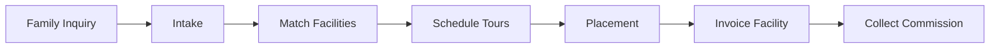

# Directive: ALF Referral Operations

## Goal

Match families needing senior living placement with appropriate ALF facilities and collect commissions on successful move-ins.

## Execution Scripts

- [alf_matcher.py](file:///c:/Users/nearm/.gemini/antigravity/playground/empire-unified/execution/alf_matcher.py) - Facility matching
- [facility_outreach.py](file:///c:/Users/nearm/.gemini/antigravity/playground/empire-unified/execution/facility_outreach.py) - Partner recruitment

## Database Schema

Run [alf_referral_schema.sql](file:///c:/Users/nearm/.gemini/antigravity/playground/empire-unified/scripts/alf_referral_schema.sql) in Supabase.

## Referral Pipeline

## Status Definitions

| Status | Description |
|--------|-------------|
| intake | Initial contact, gathering info |
| matching | Finding facility matches |
| touring | Tours scheduled/in progress |
| placed | Move-in complete |
| lost | Did not convert |

## Commission Rules

> ⚠️ **CRITICAL**: Cannot collect commission on Medicaid recipients (Florida law).

| Facility Rate | Commission (100%) |
|---------------|------------------|
| $3,500/month | $3,500 |
| $4,500/month | $4,500 |
| $5,500/month | $5,500 |

## Lead Sources

| Source | Expected Volume |
|--------|----------------|
| Girlfriend referrals | 5/month |
| Website inquiries | TBD |
| Facebook groups | TBD |
| Partner referrals | TBD |

## Self-Annealing Log

| Date | Error | Fix Applied | Outcome |
|------|-------|-------------|---------|
| (auto-populated) | - | - | - |
