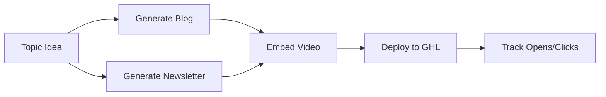

# Directive: Blog & Newsletter Pipeline

## Goal

Generate and deploy SEO-optimized blogs and email newsletters with embedded videos and AI-related content to nurture customer base.

## Execution Scripts

- [blog_generator.py](file:///c:/Users/nearm/.gemini/antigravity/playground/empire-unified/execution/blog_generator.py) - AI blog creation
- [newsletter_engine.py](file:///c:/Users/nearm/.gemini/antigravity/playground/empire-unified/execution/newsletter_engine.py) - Email campaigns

## Blog Templates

| Template | Tone | Word Count |
|----------|------|------------|
| ai_tips | Helpful, conversational | 800 |
| industry_update | Professional, informative | 1000 |
| case_study | Storytelling with data | 1200 |
| how_to | Clear, instructional | 900 |

## Newsletter Types

| Type | Subject Prefix | Use Case |
|------|---------------|----------|
| weekly_tips | 🤖 AI Tip of the Week | Regular engagement |
| product_update | 🚀 What's New | Feature announcements |
| case_study | 📈 Success Story | Social proof |
| ai_news | 🔮 AI Insights | Thought leadership |

## Content Guidelines

1. **No AI-isms** - Remove "delve", "tapestry", "landscape"
2. **Embed videos** - Include generated ad videos in blogs
3. **Strong CTAs** - Always link to booking page
4. **SEO optimized** - Include meta descriptions and keywords

## Workflow

## Self-Annealing Log

| Date | Error | Fix Applied | Outcome |
|------|-------|-------------|---------|
| (auto-populated) | - | - | - |
