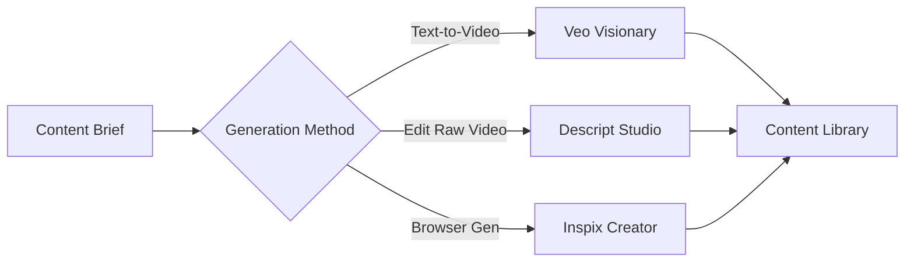

# Directive: Content Creation Pipeline

## Goal

Automatically generate ad content using AI tools (Veo, Descript, Inspix) and store in the content library for distribution.

## Execution Scripts

- [veo_visionary.py](file:///c:/Users/nearm/.gemini/antigravity/playground/empire-unified/execution/veo_visionary.py) - AI video generation
- [creatomate_studio.py](file:///c:/Users/nearm/.gemini/antigravity/playground/empire-unified/execution/creatomate_studio.py) - Cloud video editing
- [inspix_creator.py](file:///c:/Users/nearm/.gemini/antigravity/playground/empire-unified/execution/inspix_creator.py) - Browser automation

## Workflow

## Generation Rules

1. **Budget Control**: Max $20 per video generation
2. **Quality Check**: All content reviewed before distribution
3. **Platform Optimization**: Export in correct aspect ratios

## Platform Export Presets

| Platform | Aspect Ratio | Resolution |
|----------|--------------|------------|
| YouTube | 16:9 | 1920x1080 |
| Instagram Reels | 9:16 | 1080x1920 |
| TikTok | 9:16 | 1080x1920 |
| Instagram Feed | 1:1 | 1080x1080 |
| Twitter | 16:9 | 1280x720 |

## Self-Annealing Log

| Date | Error | Fix Applied | Outcome |
|------|-------|-------------|---------|
| (auto-populated) | - | - | - |
