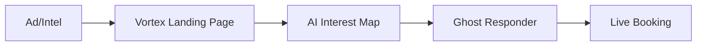

# Vortex Strategy Blueprint: The Slide Deck

*Presented by Nick Saraev | Mission: Total Market Dominance*

---

````carousel
# Slide 1: The Problem
## The Leaky Bucket Effect

Standard lead generation is a "Leaky Bucket".
- **High CPA**: Paying for leads that don't convert.
- **Slow Response**: 50% of families choose the first ALF that responds.
- **Data Loss**: Leads fall through the cracks of manual CRM entries.


<!-- slide -->

# Slide 2: The Solution
## The Vortex Engine

We don't just "generate leads". We **recruit residents**.
- **Predator Intel**: Identifying families before they reach aggregators.
- **12s Response**: Ghost Responder logic for instant engagement.
- **Universal CC**: 100% owner visibility into every conversation.


<!-- slide -->

# Slide 3: Seacoast Mission
## Operation Silver Shield

Targeting the $8B+ Tampa Senior Care Market.
- **Crisis Track**: Targeting hospital/rehab discharges for immediate placement.
- **Memory Track**: Positioned as the specialist for Nurse-Led cognitive care.
- **Referral Monopoly**: Automating outreach to Estate Planners & Geriatricians.


<!-- slide -->

# Slide 4: Technical Dominance
## The Spartan Stack

Built on high-performance cloud infrastructure.
- **Modal**: 24/7 Serverless Execution.
- **Gemini 1.5 Pro**: Advanced AI Reasoning & Empathy.
- **GoHighLevel**: Seamless CRM & Pipeline Management.



<!-- slide -->

# Slide 5: The Closing Path
## 5 Strategic Anchors

The requirements for **Wave 1 Launch**.
1. **Capacity**: Current "Move-In Ready" availability.
2. **Specialty**: The #1 Memory Care differentiator.
3. **The Hook**: The most impressive part of the tour.
4. **Logistics**: Transition assistance availability.
5. **Brand Tone**: Authoritative vs. Compassionate.

<!-- slide -->

# Slide 6: Proven Scale
## The Millennium Wave

The engine is already producing results at scale.
- **1,000+ Leads**: Managed across 9 high-value sectors.
- **Multi-City Grid**: Active in Tampa, Orlando, Miami, JAX, Atlanta, and Savannah.
- **50 Research/hr**: High-velocity autonomous lead processing.


<!-- slide -->

# Slide 7: Safety & Accountability
## The Spartan Mandate

Total visibility. Zero budget waste.
- **Universal CC**: 100% of outreach mirrored to owner.
- **Auto-Pause**: Safety kill-switch active for all ad spend.
- **Modal Cloud**: 24/7 persistence with zero local down-time.

---
**Status**: MASTER STRATEGY LOCKED.
````
