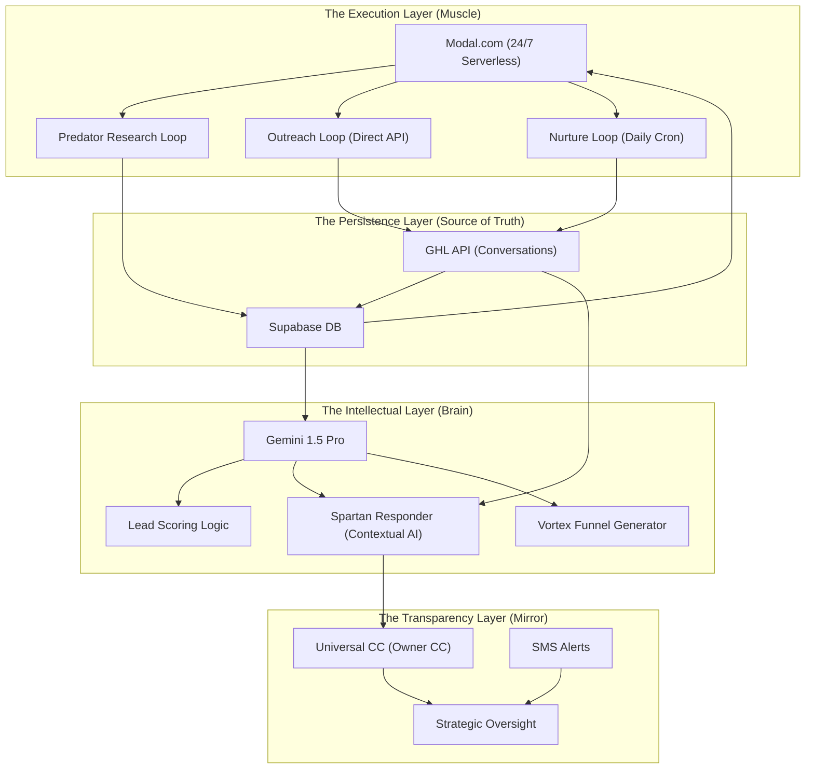

# VORTEX SYSTEM: THE ENGINE ROOM

**Deep Technical Architecture & Cloud Orchestration**

---

## 1. High-Level Logic Map

The system is built as a modular, distributed engine that separates "Intent" from "Execution".

---

## 2. Component Breakdown

### A. The Predator Engine (Discovery)

- **Tech**: Playwright (on Modal) + Gemini 1.5.
- **Workflow**: Scrapes target websites, identifies technical "leaks", and writes personalized hooks.
- **Velocity**: Capable of auditing 50 leads per hour (Cloud-parallelized).

### B. The Ghost Responder (Conversion)

- **Tech**: GHL Webhooks + Gemini 1.5.
- **Logic**: 12-second trigger. Analyzes inbound sentiment. If intent is >0.8, it drafts/sends a Spartan reply. If <0.8, it stages for internal review.

### C. The Authority Nurture (Retention)

- **Tech**: Daily Cron Job (Modal).
- **Workflow**: Automated follow-ups on Day 3, 10, and 20. Uses "Trigger Links" to detect interest re-engagement.

---

## 3. Security & Visibility

- **Statewide Mirroring**: 100% of outbound communications are CC'd to `owner@aiserviceco.com`.
- **Vault Safety**: All API keys are stored in encrypted Modal Secrets (`agency-vault`).
- **Heartbeat Guardian**: A 'System Guardian' cron runs every 60m to verify GHL and Supabase connectivity.

---
**Status**: TECHNICAL DOCUMENTATION COMPLETE.
